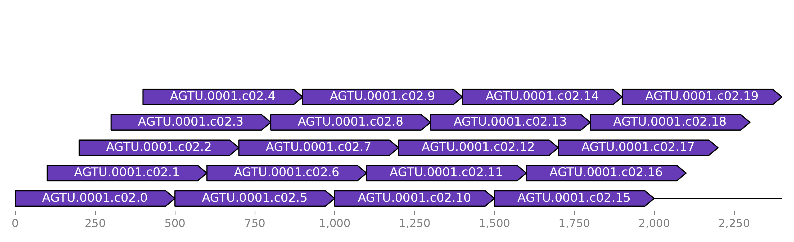

# Deletion detection for haploid genomes

## Introduction

This package identifies and annotates large deletions in evolved bacterial strains. The underlying approach is very simple making it reliable and fast. The annotated genome of the ancestral strain and the assembly of the mutated strains are inputted. The two genomes are aligned and deletions detected. The output includes the deleted products and positions relative to the reference as well as the positions in the mutated strain. Additionally entirely deleted plasmids are outputted and annotated separately. To help verifying the deletions, alignment plots are generated optionally.
Because of it's simple design, this package only takes about 2 minutes to process even when run locally.
This package was developed with assemblies generated with PacBio data. It's recommended to use high-quality assemblies only derived ether from PacPio data or hybrid-assembled Nanopore and Illumina data.

## Installation

This package requires `SAMtools>=1.11` and `minimap2` in your PATH.  
The package itself can be installed using pip.
```
git clone git@github.com:nahanoo/deletion_detection.git
cd deletion_detection
pip install .
```
Pip will create a console script for you called `detect_deletions` which will be callable outside the project folder.

## Usage

Help page called with `detect_deletions -h`:
```
usage: detect_deletions [-h] [--plot] ancestral mutant out_dir

Detect insertions in evolved bacterial strains.

positional arguments:
  ancestral   fasta file of the ancestral strain
  mutant      genbank file of the mutated strain.
  out_dir     output directory

optional arguments:
  -h, --help  show this help message and exit
  --plot      plots alignment of deletions
```

Example command:
```
detect_deletions --plot ancestral.gbk mutant.fasta ./
```
The optional `--plot` flags plots the alignments around identified deletions.

## Background

The genome of the mutated strain is chunked into smaller sequences using a sliding window approach. In detail, the genome is chunked into 500 base-pair chunks with with a start position shift of 100 base-pairs.
Below you can see the alignment of such chunks against itself:

The id of the sequence consists of the contig name and the enumerated step count.
These chunks of the mutated strain are then aligned to the ancestral genome. Below you can see such an alignment at a position with no coverage. This plot is outputted if you add `--plot` flag.

As you can see there is a gap in the alignment. At this position the sequence is only present in the ancestral strain and thus deleted in the mutated strain. Because we aligned it to the ancestral genome we only know the position relative to the ancestral genome.  
In order to find the position in the genome of the mutant, the sequence of the ancestral genome around additional present sequence is extracted with 2000 flanking base-pairs. This extracted sequence is aligned to the mutant strain and based on this alignment the position in the mutant genome is identified.

## Outputs

`no_coverage.tsv` contains all the positions in the ancestral genome with no coverage.  
`deletions.tsv` contains all deletions with the positions in the mutated genome and the positions in the ancestral genome. The ancestral contig name and positions are stored with the column names `chromosome_orign` and `position_origin`.  
`deletions.annotated.tsv` has an additional column called `product` which stores which products were deleted.
`plasmids.tsv` contains all deleted plasmids. Contig names can only be from the reference because the contigs don't exist in the mutated strain.  
`plasmids.annotated.tsv` contains the additional column called `products` which stores all products located on the plasmid which was deleted.

Plots are stored in the `plots` directory. In the `alignemtns` sub-folder you find the alignments of the chunked sequences to the ancestral genome in regions with no coverage. There is also a visualization of the deleted products which is stored in the `annotation` sub-folder.


